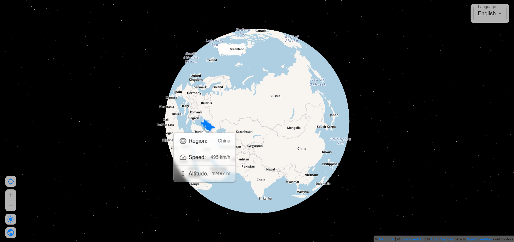

# ✈️ FlyRad — Real-time Flight Radar

**FlyRad** — это веб-приложение для отслеживания самолётов в реальном времени. Приложение определяет ваше местоположение и показывает все воздушные суда в выбранном радиусе, предоставляя подробную информацию о каждом самолёте.

## 🌟 Особенности

- **📍 Определение местоположения** — автоматически определяет вашу позицию или позволяет указать её вручную
- **✈️ Отслеживание самолётов в реальном времени** — показывает все воздушные суда в радиусе до 350 км
- **🔍 Детальная информация** — по каждому самолёту: страна, высота, скорость
- **🎨 Гибкая визуализация** — переключение между 2D/3D режимами (плоская карта или глобус)
- **🌓 Темы интерфейса** — светлая и тёмная темы
- **🌍 Мультиязычность** — поддержка нескольких языков интерфейса
- **📱 Адаптивный дизайн** — оптимизировано для мобильных устройств и десктопов

## 🚀 Технологический стек

**Фронтенд:**

- React 18 + TypeScript
- Redux Toolkit (управление состоянием)
- React Map GL / MapLibre (карты)
- Feature-Sliced Design (архитектура)

**Бэкенд/Сервисы:**

- Supabase Edge Functions (проксирование API, решение CORS)
- Supabase Storage (хранение стилей карт)
- ADS-B API (данные о самолётах)
- OpenFreeMap (бесплатные тайлы карт)

**Инструменты:**

- Webpack (сборка)
- ESLint + Stylelint (линтеры)
- GitHub Actions (CI/CD)
- GitHub Pages (хостинг)

### 🖼️ Основной интерфейс

